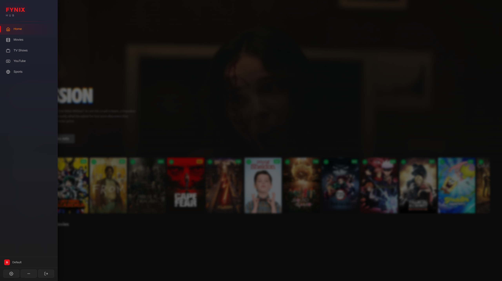
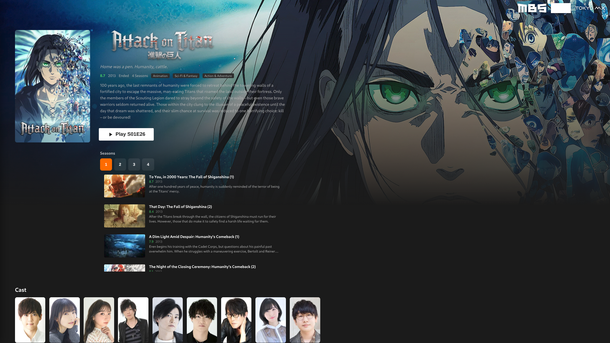
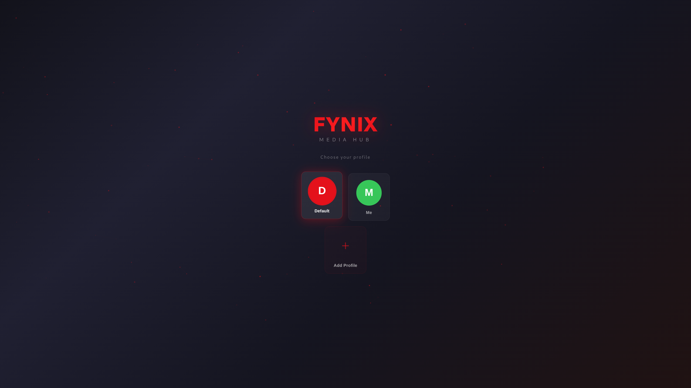
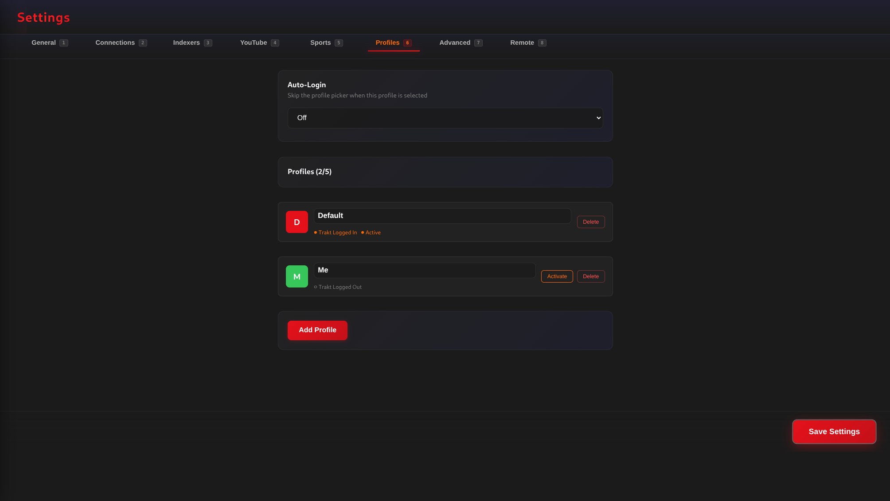

# Fynix Hub (vibe coded in conjuction with OpenCode and Big Pickle. This app contains code produced by AI)

An all-in-one Linux entertainment hub providing access to movies, TV shows, YouTube, sports replays, and other user-configured media sources through a beautiful unified interface. Built with Electron, React, and Vite.

<p>
  
  
  
  
</p>

<p>
  <a href="https://ko-fi.com/X5Q621P6WX"></a>
</p>

If you find this project useful, consider supporting development on Ko-fi. Every contribution helps keep the project alive and growing.

> **Fynix applications do not host, distribute, or provide any media content.** Users are responsible for supplying their own media sources where required. Any information, metadata, or links presented by Fynix are aggregated from publicly accessible websites and services. The developer of Fynix accepts no responsibility for how the software is used or for the availability, legality, or content of third-party services accessed through it. Users are responsible for ensuring they comply with all applicable laws and the terms of any services they use.

## Features

### Media Browsing
- **Movies & TV Shows** — browse trending, popular, top-rated, and upcoming content via TMDB integration
- **YouTube** — search and watch YouTube content directly within the app
- **Sports Replays** — dedicated sports section with paginated event browsing and replay links
- **Unified Library** — all your media sources in one place with a consistent navigation interface
- **Continue Watching** — resume playback from where you left off across sessions

### Search
- **Multi-source search** — search across TMDB (movies/TV), torrent indexers, Usenet providers, and Vyla streams simultaneously
- **13 built-in torrent indexers** — YTS, EZTV, TPB, Nyaa, 1337x, Torrentio, MediaFusion, Kickass, MagnetDL, BitSearch, RuTor, Torrentz2, ShowRSS
- **Custom indexers** — add your own Torznab-compatible indexers
- **Usenet support** — Newznab-compatible indexer search with NZB download and streaming via NZBGet
- **Debrid cache checking** — automatically checks Real-Debrid, All-Debrid, and Premiumize for cached torrents

### Playback
- **HTML5 playback** — high-quality video playback via built-in HTML5 player with hardware acceleration
- **Auto-play** — automatically cycle through torrent results until one plays successfully
- **Vyla / Rivestream** — optional streaming sources for instant playback without downloading
- **Sports live streaming** — watch live sports events directly from supported sources
- **Resume playback** — pick up where you left off with per-title progress tracking

### Linux Desktop
- **Native packages** — available as .deb, .rpm, .AppImage, and .zip
- **Auto-updater** — automatic update checking from GitHub Releases (AppImage auto-updates in-place)
- **Beautiful TV-friendly UI** — designed for 10-foot navigation with keyboard and remote control
- **Plugin architecture** — extensible provider system for adding new media sources

### Privacy
- **No tracking** — no telemetry, no analytics, no data collection
- **No account required** — use anonymously with no registration
- **Open source** — every line of code is open and auditable

## Screenshots

| Screen | Description |
|--------|-------------|
|  | Home browser with trending movies, TV shows, and quick access |
|  | Movie/title details with metadata, ratings, and source selection |
|  | Profile picker / splash screen on launch |
|  | Configuration panel with search providers, debrid services, and playback options |

## Quick Install (Linux)

```bash
curl -sL https://raw.githubusercontent.com/Boc86/Fynix-Hub/dev/scripts/install-fynix.sh | bash
```

Downloads the latest AppImage to `~/Applications/`, creates a desktop entry under **Multimedia**, and adds an app icon.

## Download

Download the latest release for Linux from the [Releases page](https://github.com/Boc86/Fynix-Hub/releases).

### Available Formats

| Format | File | Auto-Update |
|--------|------|-------------|
| AppImage | `Fynix_Hub-*.AppImage` | ✅ In-place update |
| Debian / Ubuntu | `fynix-hub_*_amd64.deb` | ❌ (manual re-download) |
| Fedora / RHEL / openSUSE | `fynix-hub-*.x86_64.rpm` | ❌ (manual re-download) |
| Portable ZIP | `Fynix Hub-linux-x64-*.zip` | ❌ (manual re-download) |

### System Requirements

- **OS**: Linux (x86_64)
- **Runtime**: No additional dependencies — all libraries bundled
- **Recommended**: 4 GB RAM, modern GPU with video acceleration

## Configuration

### Search Providers

| Setting | Description |
|---------|-------------|
| Torrent Indexers | Enable/disable built-in indexers and add custom Torznab URLs |
| Usenet Indexers | Add Newznab-compatible indexers with API keys |
| Vyla / Rivestream | Optional streaming source (TMDB-based) |
| Debrid Services | Real-Debrid, All-Debrid, Premiumize for cached torrent streaming |

### Media Sources

| Source | Type | Description |
|--------|------|-------------|
| TMDB | Metadata | Movie and TV show metadata, posters, ratings |
| YouTube | Video | Search and watch YouTube content |
| Torrent Indexers | Media | Public and private torrent indexers for media discovery |
| Usenet | Media | Newznab-compatible Usenet indexers |
| NZBGet | Downloader | Usenet NZB download client integration |
| HTML5 Player | Player | High-quality video playback via HTML5 + FFmpeg remux |

### Keyboard Navigation

| Key | Action |
|-----|--------|
| Arrow keys | Navigate UI |
| Enter | Select / Play |
| Escape | Go back / Close modal |
| Backspace | Go back |

## Building from Source

```bash
git clone https://github.com/Boc86/Fynix-Hub.git
cd Fynix-Hub
npm install
npm run make
```

The built packages will be in the `out/make/` directory.

### Prerequisites

- Node.js 22+
- npm
- For .deb builds: `dpkg`, `fakeroot`
- For .rpm builds: `rpmbuild`
- For AppImage builds: `appimagetool`

### Development

```bash
npm start
```

This launches the app with hot-reload for development.

### Testing

```bash
npm run lint    # TypeScript type checking
npm run make    # Build all packages
```

## Tech Stack

- **Frontend**: React, TypeScript, Zustand (state management), CSS Modules
- **Backend**: Electron, Vite (bundler), Electron Forge (packaging)
- **Data**: TMDB API, torrent indexers, Newznab Usenet, YouTube
- **Player**: HTML5 (browser-based video playback with FFmpeg remux)
- **Updates**: electron-updater (GitHub Releases)
- **Packaging**: Debian (.deb), RPM (.rpm), AppImage, portable ZIP

## License

GPL-3.0 license
